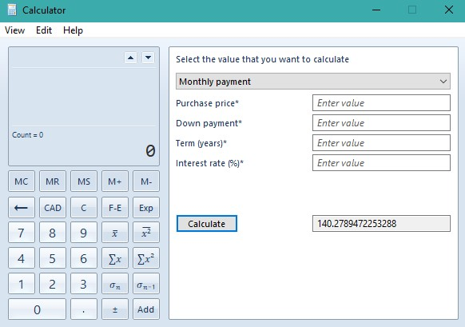
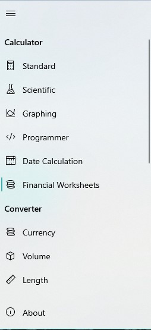
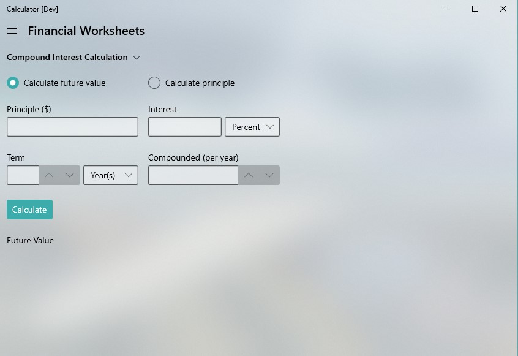
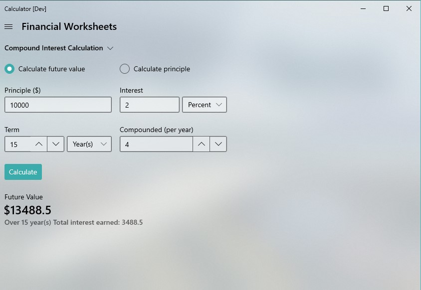
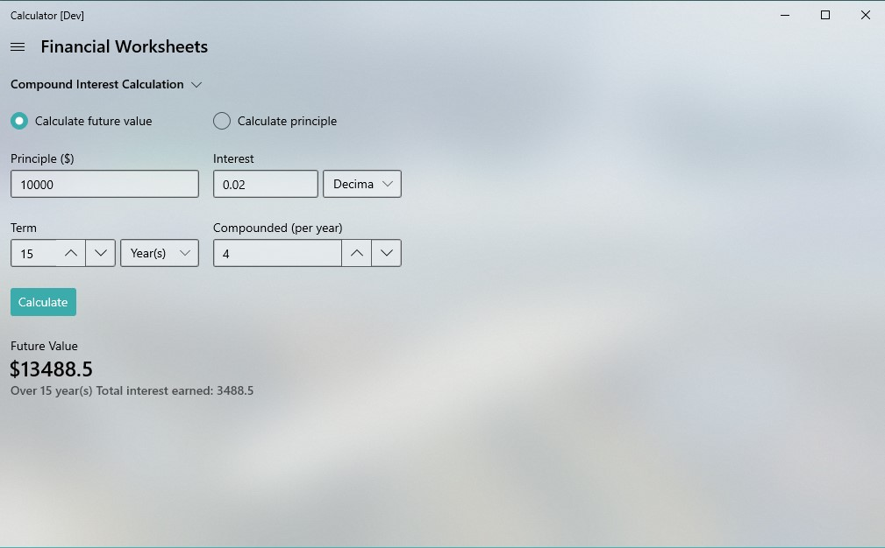
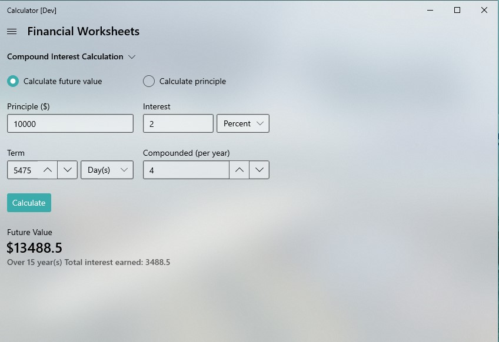
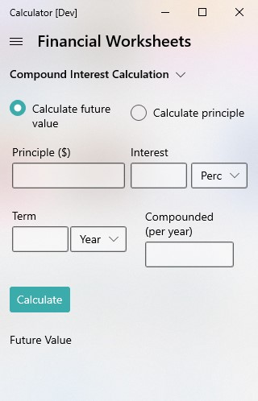
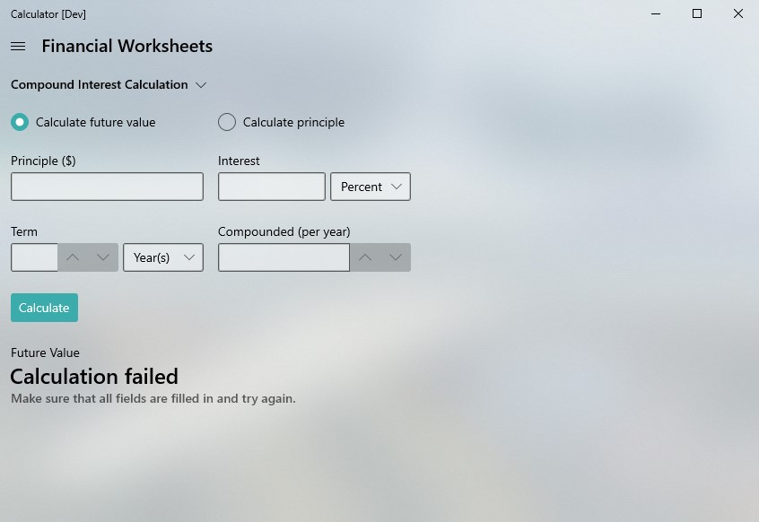
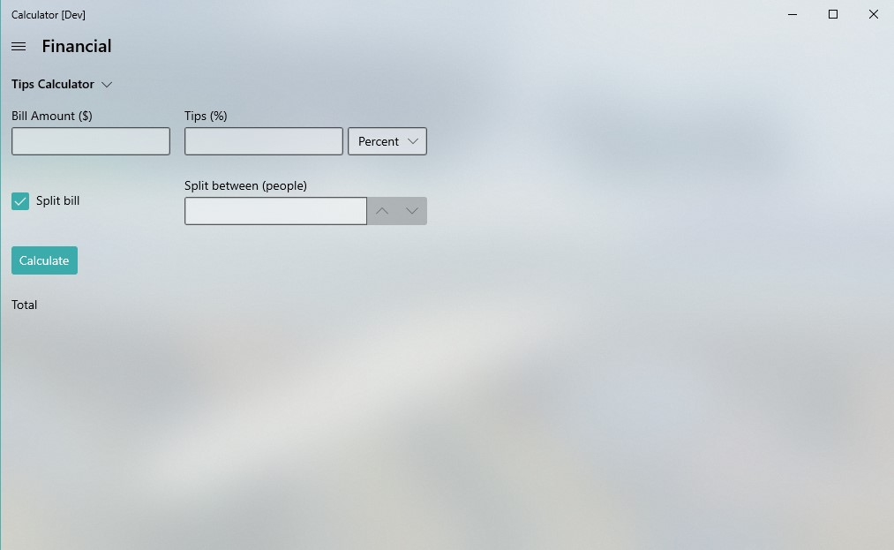
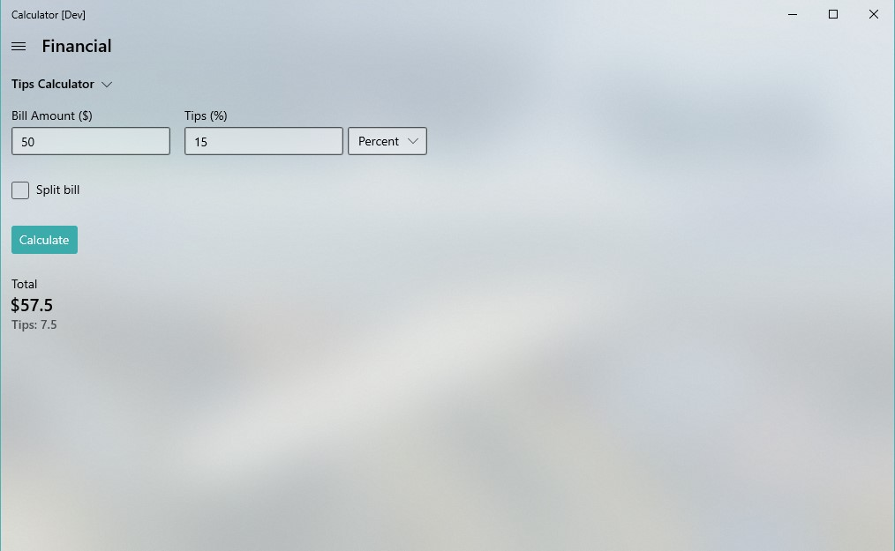

## Financial Calculator

### Feature Pitch Link
https://github.com/Microsoft/calculator/issues/806

### Problem Statement
This will create a new calculation mode, "Financial". It will be similar to the date calculator with a combobox at the top to choose modes (modes are tip calculator, compound interest, and mortgage calculator). Target audience: Anyone from financial investors to people going out for lunch.

### Evidence or User Insights
We should do this to offer more tools to calculator users and make this a more feature-packed calculator (GitHub issue: [#806](https://github.com/Microsoft/calculator/issues/806)) and also [Feedback Hub feedback](https://aka.ms/AA9kceq)

### Proposal
Create a new feature "Financial". With it, we can target investors and even students learning about finance. As Windows Calculator from Windows 7 had a few worksheets to calculate mortgage, fuel economy, etc so it will be easier for people transitioning from Win7 to Win10:
 

 
The Mortagage Calculator in Windows 7 Calculator

### Goals and Non-Goals
### Goals
* Create a compound interest calculator (Find future value and principle)
* Tips calculator (Find total bill amount, and amount not including tips)
* Mortgage Calculator (Solve for monthly payment and purchase price)

### Non-Goals
* Even more modes

### Success Criteria
Sucess can be mesured with users, and engagement time.

### Feature Requirements
* To find the future value (compound calculator), users can input Principle, term (in day, month or year), times compounded (per year), and interest rate (percentage or decimal) to get the future rate.
> Formula: Future Value = Principle(1+(interest [in decimal]/frequency))^Years* Frequency [[1]](https://www.wikihow.com/Calculate-Compound-Interest#:~:text=Part%202%20of%203%3A%20Calculating%20Compound%20Interest%20on,you%20are%20inputting%20them%20correctly.%20More%20items...%20).

* To find the principle (compound calculator), users can input future value, term (in day, month, or year), times compounded (per year) and interest rate (percentage or decimal)
> Formula: Principle = Future Value / (1+(interest[in decimal]/frequency))^Years* Frequency

* Users can input the bill amout, tip percentage and if they want to split the bill (and if yes, between how many people) and recieve the result.
> Fomula: Total = Amount Due * 1.Tip (percentage) [[2]](https://www.calculatorsoup.com/calculators/financial/tip-calculator.php)

### Feature Details and High-Fidelity Concept

 
Navbar...
 
### Compoound Interest Page

 
Compound Interest Page…
 
The result should be the same as long as the the values are equal (just in different, e.g. 365 days, 12 months, 1 year)
 

 
Results (1)...
 

 
Results (2)...
 

 
Results (3)...
 

 
If one or more fields are not filled out, an error will show.
 

 
Here's how it will look when minimied to the smallest possible size. All spin buttons will become hidden and grids will tighten. 

### Tip page

 
Tip calculation page, without splitbill on
 

 
Tip calculation page, with splitbill on
 

 
Tip calculation, Results (1)
 

 
Tip calculation, Results (2)
 

 
Tip calculation, Results (3)
 

 
Just like the compound interest calculator, if one or more fields are empty, it will display a warning.

### Appendix
Phases:
Look at devoloping more modes later on.

Risks and Open Issues:
Open issue: I think the everything is up for discussion. 
Risks: I don't think there are.

### References
1. [Wikihow - How to calculate Compound Interest](https://www.wikihow.com/Calculate-Compound-Interest#:~:text=Part%202%20of%203%3A%20Calculating%20Compound%20Interest%20on,you%20are%20inputting%20them%20correctly.%20More%20items...%20)
2. [CalculatorSoup - Tip Calculator](https://www.calculatorsoup.com/calculators/financial/tip-calculator.php)

Note: These are the earliest iterations of the calc and is _subject to change_. All mocks are from my prototype that can be found at [chips1234/calculator:FinancialSpec](https://github.com/Chips1234/calculator/tree/FinancialSpec)
